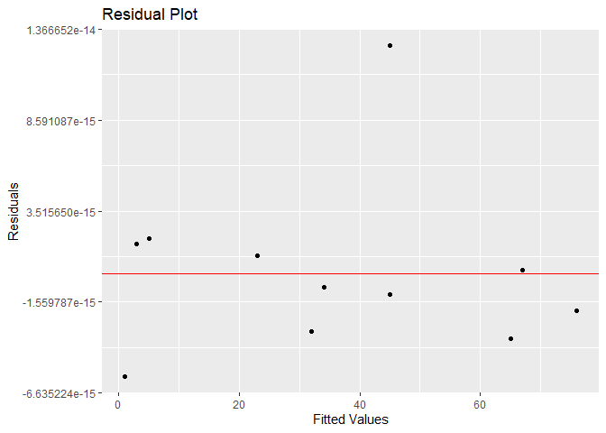
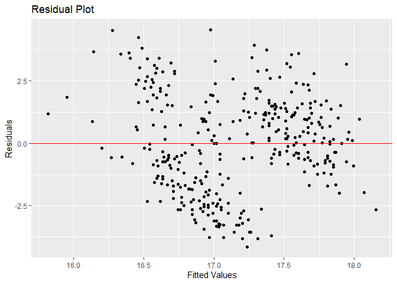
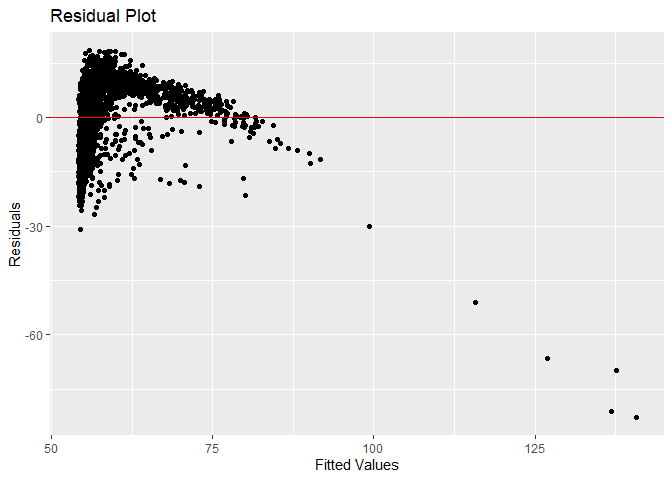

B1
================
Nat
2023-10-31

``` r
library(tidyverse)
```

    ## ── Attaching core tidyverse packages ──────────────────────── tidyverse 2.0.0 ──
    ## ✔ dplyr     1.1.3     ✔ readr     2.1.4
    ## ✔ forcats   1.0.0     ✔ stringr   1.5.0
    ## ✔ ggplot2   3.4.3     ✔ tibble    3.2.1
    ## ✔ lubridate 1.9.2     ✔ tidyr     1.3.0
    ## ✔ purrr     1.0.2     
    ## ── Conflicts ────────────────────────────────────────── tidyverse_conflicts() ──
    ## ✖ dplyr::filter() masks stats::filter()
    ## ✖ dplyr::lag()    masks stats::lag()
    ## ℹ Use the conflicted package (<http://conflicted.r-lib.org/>) to force all conflicts to become errors

# Exercise 1 and 2

``` r
#' Residual Plot for Simple Linear Models
#' 
#' This model creates a residual plot for a linear model with 1 explanatory variable. This can be used to test if the model meets the linearity and equal variance assumptions
#'
#' @param df **D**ata **f**rame being used, hence **df**
#' @param y Numeric vector from df, which is the response variable, or "y" variable, need to be in df$column_name
#' @param b1 Numeric Vector from df, which is the explanatory variable. In simple linear regression, the slope associated with the first x variable would be b1, need to be in ""
#'
#' @return A graph

residual_plot <- function(df,y,b1){
  if(!is.numeric({{b1}})){ #must be numeric
    stop()
  }
  if(!is.numeric({{y}})){ #must be numeric
    stop()
  }
  model <- lm({{y}} ~ {{b1}}, data=df) #creating linear model
  ggplot(model, aes(x = .fitted, y = .resid)) + #plotting
  geom_point() +
  geom_hline(yintercept = 0, color="red") +
  labs(title='Residual Plot', x='Fitted Values', y='Residuals')
}
```

# Exercise 3

``` r
# Test 1
x <- c(2,45,6,73,24,4,23,5,645,23,34,65) #random numbers
y <- c(32,45,1,34,5,67,3,45,65,76,45,23) #random numbers
test <- tibble(x,y) #make data to use
residual_plot(test,test$x,test$y) #it plots
```

<!-- -->

``` r
#Test 2
library(palmerpenguins)
residual_plot(penguins, penguins$bill_depth_mm, penguins$bill_length_mm) #trying with penguins
```

<!-- -->

``` r
#Test 3
library(gapminder)
residual_plot(gapminder, gapminder$lifeExp,gapminder$gdpPercap) #trying with gapminder
```

<!-- --> \# Exercise 4

``` r
library(testthat)
```

    ## 
    ## Attaching package: 'testthat'

    ## The following object is masked from 'package:dplyr':
    ## 
    ##     matches

    ## The following object is masked from 'package:purrr':
    ## 
    ##     is_null

    ## The following objects are masked from 'package:readr':
    ## 
    ##     edition_get, local_edition

    ## The following object is masked from 'package:tidyr':
    ## 
    ##     matches

``` r
test_that("Function returns ggplot object",{
  is.plot <- residual_plot(gapminder,gapminder$lifeExp,gapminder$gdpPercap) #function we are testing
  expect_is(is.plot,"ggplot") #should be a ggplot product
})
```

    ## Test passed 😀

``` r
test_that("This function only works for numeric values", {
  expect_error(residual_plot(penguins, penguins$species, penguins$bill_length_mm)) #species is categorical 
  expect_error(residual_plot(penguins, penguins$bill_length_mm, penguins$species)) #try in both variable options
  expect_no_error(residual_plot(penguins, penguins$bill_depth_mm, penguins$bill_length_mm)) #both numeric
})
```

    ## Test passed 😸

``` r
test_that("GGplot is creating correct residuals and fitted values", {
  model.1 <- lm(lifeExp ~ gdpPercap, data = gapminder) #linear model
  gapminder$fitted_vals <- fitted(model.1) #fitted values to compare to graph values
  gapminder$resids <- residuals(model.1) # residual values to compare to graph values
  test1 <- residual_plot(gapminder, gapminder$lifeExp,gapminder$gdpPercap) #graph from function we are testing
  from_graph_y <- data.frame(y=test1$data$.resid) #y values from graph
  from_model_y <- data.frame(y=gapminder$resids) #y values we found through model
  expect_equal(from_graph_y$y, from_model_y$y) #they should be the same
  from_graph_x <- data.frame(x=test1$data$.fitted) #x values from graph
  from_model_x <- data.frame(x=gapminder$fitted_vals) #x values we found through model
  expect_equal(from_graph_y$y, from_model_y$y) #they should be the same
})
```

    ## Test passed 😀
